<p align="center">
  
  
  
  
  
</p>

<h1 align="center">
  🔬 D²NN Digital Twin
  <br>
  <sub>Gêmeo Digital para Computação Óptica Generativa</sub>
</h1>

<p align="center">
  <strong>Simulador de alta fidelidade para Redes Neurais Difrativas (D²NN) com física rigorosa de propagação óptica</strong>
</p>

<p align="center">
  <a href="#-vídeo-demonstração">Vídeo</a> •
  <a href="#-sobre-o-projeto">Sobre</a> •
  <a href="#-resultados-visuais">Resultados</a> •
  <a href="#-métricas-de-qualidade">Métricas</a> •
  <a href="#-instalação">Instalação</a> •
  <a href="#-referências">Referências</a>
</p>

---

## 🎬 Vídeo Demonstração

<p align="center">
  <a href="https://youtu.be/ydwNh7mtjvU">
    
  </a>
</p>

<p align="center">
  <a href="https://youtu.be/ydwNh7mtjvU">
    
  </a>
  <a href="https://colab.research.google.com/github/Diyanderson/d2nn-digital-twin/blob/main/D2NN_DigitalTwin_OpticalComputing.ipynb">
    
  </a>
</p>

---

## 📖 Sobre o Projeto

Este projeto apresenta um **Gêmeo Digital** completo para simulação de **Redes Neurais Difrativas (D²NN)** — uma arquitetura revolucionária que substitui operações matriciais por **propagação física de luz**, alcançando inferências à velocidade da luz (~299.792 km/s) com consumo energético próximo de zero.

### 🎯 Motivação

| Problema | Solução D²NN |
|----------|--------------|
| GPUs consomem ~400W por inferência | Luz propaga sem consumo (passivo) |
| Latência de ms em redes profundas | Inferência em **nanosegundos** |
| Aquecimento por efeito Joule | Fótons não geram calor |
| Fabricação física custa ~USD 40.000+ | **Simulação digital a custo zero** |

### 🧠 Conceito: IA ↔ Óptica

```
┌─────────────────────┬──────────────────────────────────┐
│ Conceito de IA      │ Equivalente Óptico               │
├─────────────────────┼──────────────────────────────────┤
│ Neurônio            │ Pixel do SLM (modulador de luz)  │
│ Pesos               │ Espessura/fase da máscara DOE    │
│ Forward Pass        │ Propagação física (difração)     │
│ Backpropagation     │ Método adjunto (gradiente)       │
│ Inferência (ms)     │ Passagem de luz (~ns)            │
└─────────────────────┴──────────────────────────────────┘
```

---

## 📐 Arquitetura do Sistema

```
                    ┌─────────────────────────────────────────────┐
                    │         LASER HeNe (633nm, 20mW)            │
                    └─────────────────┬───────────────────────────┘
                                      │
                                      ▼
    ┌──────────┐    ┌──────────┐    ┌──────────┐    ┌──────────┐    ┌──────────┐
    │    L1    │───▶│    L2    │───▶│    L3    │───▶│    L4    │───▶│    L5    │
    │  T≈44%   │    │  T≈45%   │    │  T≈42%   │    │  T≈30%   │    │  T≈10%   │
    │   4cm    │    │   4cm    │    │   4cm    │    │   4cm    │    │   20cm   │
    └──────────┘    └──────────┘    └──────────┘    └──────────┘    └──────────┘
                                                                         │
                                                                         ▼
                                                                   ┌──────────┐
                                                                   │  SENSOR  │
                                                                   │  256×256 │
                                                                   └──────────┘
```

**Especificações Técnicas:**

| Parâmetro | Valor | Descrição |
|-----------|-------|-----------|
| **Grid** | 256×256 | Resolução espacial |
| **Pixel** | 20µm | Tamanho do pixel SLM |
| **λ** | 633nm | Laser HeNe vermelho |
| **Substrato** | SiO₂ (n=1.46) | Sílica fundida |
| **Camadas** | 5 DOEs | Elementos Ópticos Difrativos |
| **Potência** | 20mW | Laser de entrada |

---

## 🎨 Resultados Visuais

### 🔬 Experimento 1: FADER COUNT (11 Frames)

<table>
  <tr>
    <th align="center">INPUT</th>
    <th align="center">TARGET</th>
    <th align="center">OUTPUT</th>
  </tr>
  <tr>
    <td align="center">
      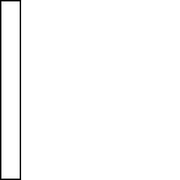<br>
      <sub>Máscara do fader</sub>
    </td>
    <td align="center">
      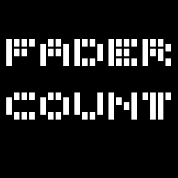<br>
      <sub>Texto + Dígitos 0-9</sub>
    </td>
    <td align="center">
      <br>
      <sub>Simulação óptica</sub>
    </td>
  </tr>
</table>

**Propagação de Fase por Camada (HSV Colormap):**

<table>
  <tr>
    <th align="center">L1 (T=44%)</th>
    <th align="center">L2 (T=45%)</th>
    <th align="center">L3 (T=42%)</th>
    <th align="center">L4 (T=30%)</th>
    <th align="center">L5 (T=10%)</th>
  </tr>
  <tr>
    <td align="center">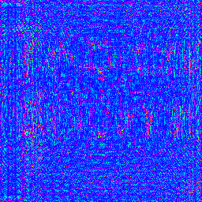</td>
    <td align="center">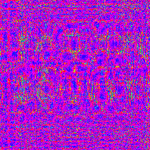</td>
    <td align="center">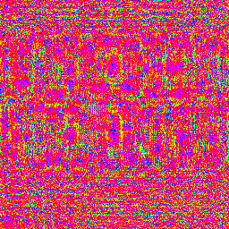</td>
    <td align="center">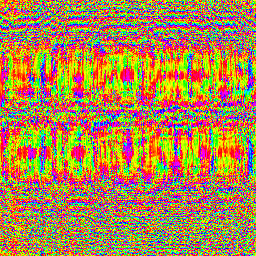</td>
    <td align="center">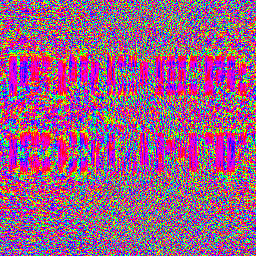</td>
  </tr>
</table>

---

### 🎬 Experimento 2: MICHAEL JACKSON (52 Frames)

<table>
  <tr>
    <th align="center">INPUT</th>
    <th align="center">TARGET</th>
    <th align="center">OUTPUT</th>
  </tr>
  <tr>
    <td align="center">
      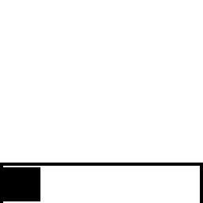<br>
      <sub>Fader + Time bar</sub>
    </td>
    <td align="center">
      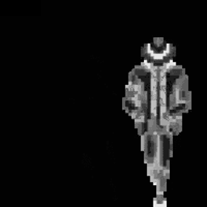<br>
      <sub>Silhueta invertida</sub>
    </td>
    <td align="center">
      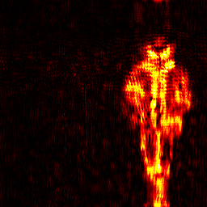<br>
      <sub>Simulação óptica</sub>
    </td>
  </tr>
</table>

**Propagação de Fase por Camada (HSV Colormap):**

<table>
  <tr>
    <th align="center">L1 (T=48%)</th>
    <th align="center">L2 (T=47%)</th>
    <th align="center">L3 (T=44%)</th>
    <th align="center">L4 (T=36%)</th>
    <th align="center">L5 (T=3%)</th>
  </tr>
  <tr>
    <td align="center"></td>
    <td align="center"></td>
    <td align="center"></td>
    <td align="center"></td>
    <td align="center"></td>
  </tr>
</table>

---

## 📊 Métricas de Qualidade

### Comparativo de Resultados

| Experimento | SSIM ↑ | PSNR (dB) ↑ | MSE ↓ | Tempo | T_total | SNR (1ms) |
|-------------|--------|-------------|-------|-------|---------|-----------|
| **Fader Count** | 0.7027 | 22.28 | 0.0062 | 153s | 0.25% | 37,225 |
| **Michael Jackson** | 0.6053 | 22.54 | 0.0058 | 768s | 0.10% | 12,536 |

### Gráficos de Métricas

<p align="center">
  
</p>
<p align="center"><sub>📊 Métricas SSIM / PSNR / MSE — Fader Count</sub></p>

<p align="center">
  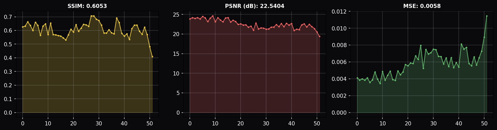
</p>
<p align="center"><sub>📊 Métricas SSIM / PSNR / MSE — Michael Jackson</sub></p>

---

## 🔥 Mapas de Transmissão

### Transmissão por Camada (Fader Count)

<p align="center">
  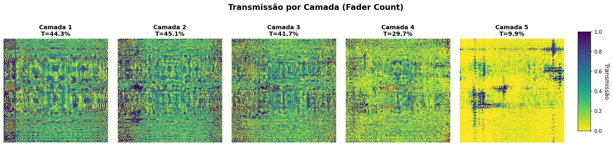
</p>
<p align="center"><sub>🔥 Azul (opaco) → Amarelo (transparente) | Viridis Colormap</sub></p>

### Comparativo Fader vs Michael Jackson

<p align="center">
  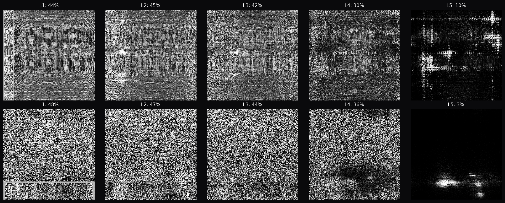
</p>
<p align="center"><sub>🔍 Mapas de transmissão das 5 camadas para ambos experimentos</sub></p>

---

## 📈 Convergência do Treinamento

<p align="center">
  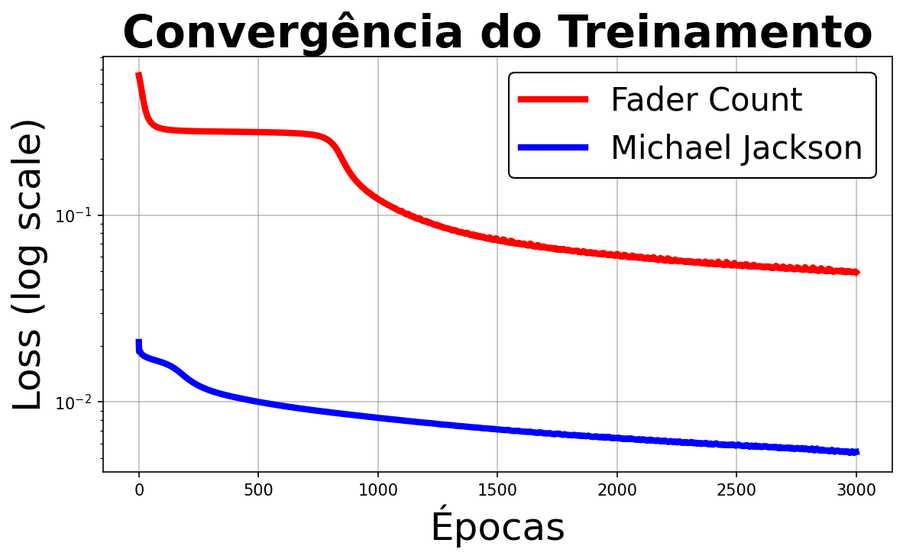
</p>

```
📉 REDUÇÃO DA PERDA:
   Fader Count:     0.5584 → 0.0494  │  Redução: 91.1%
   Michael Jackson: 0.0209 → 0.0054  │  Redução: 74.2%
```

---

## ⚡ Análise de Energia

### Fluxo de Potência (Fader Count)

```
📊 FLUXO DE ENERGIA ATRAVÉS DAS CAMADAS:

 📥 Input:   [████████████████████] 100.00%  (20.00 mW)
 🔬 Após L1: [█████░░░░░░░░░░░░░░░]  27.98%  ( 5.44 mW)
 🔬 Após L2: [█░░░░░░░░░░░░░░░░░░░]   9.11%  ( 1.77 mW)
 🔬 Após L3: [░░░░░░░░░░░░░░░░░░░░]   2.06%  ( 0.40 mW)
 🔬 Após L4: [░░░░░░░░░░░░░░░░░░░░]   0.15%  ( 0.03 mW)
 🔬 Após L5: [░░░░░░░░░░░░░░░░░░░░]   0.00%  ( 0.00 mW)

⚡ Eficiência: 0.002% → Energia redistribuída para formar padrão
```

### Inovação: Inversão de Target

| Problema Original | Solução Implementada |
|-------------------|---------------------|
| MJ claro (93%) sobre fundo escuro | Target invertido (7% energia) |
| Bloquear 93% da luz = inviável | Iluminar fundo = eficiente |
| **Demanda energética: 93.9%** | **Demanda energética: 7.5%** |

---

## ✨ Features

### 📊 Visualização (V8)
- ✅ **Energy Scaling**: `sc = target.mean() / output.mean()`
- ✅ GIFs de alta qualidade com padrões claros
- ✅ Métricas SSIM/PSNR/MSE em tempo real
- ✅ Mapas de transmissão coloridos (viridis)
- ✅ Visualização de fluxo de energia por camada

### 🔬 Física Rigorosa (V18)
- ✅ Parâmetros físicos completos (λ=633nm, n=1.46, 20mW)
- ✅ Medições de potência em **mW** durante treinamento
- ✅ Cálculo de eficiência óptica real
- ✅ Estimativa de SNR (shot noise limited)
- ✅ Exportação DOE 16-bit TIFF para litografia
- ✅ Relatórios de especificação de fabricação

### 🚀 Performance
- ✅ Aceleração GPU via CUDA/TF32
- ✅ Mixed Precision Training (AMP)
- ✅ Scheduler adaptativo (ReduceLROnPlateau)

---

## 🛠️ Instalação

### Requisitos
- Python 3.10+
- CUDA-capable GPU (recomendado)
- 4GB+ VRAM

### Setup Local

```bash
# Clone o repositório
git clone https://github.com/Diyanderson/d2nn-digital-twin.git
cd d2nn-digital-twin

# Crie ambiente virtual
python -m venv venv
source venv/bin/activate  # Linux/Mac
# ou: venv\Scripts\activate  # Windows

# Instale dependências
pip install torch torchvision torchaudio --index-url https://download.pytorch.org/whl/cu118
pip install numpy matplotlib imageio scikit-image pillow
```

---

## 🚀 Uso

### Google Colab (Recomendado)

<p align="center">
  <a href="https://colab.research.google.com/github/Diyanderson/d2nn-digital-twin/blob/main/D2NN_DigitalTwin_OpticalComputing.ipynb">
    
  </a>
</p>

1. Clique no badge acima para abrir diretamente no Colab
2. Selecione **Runtime → Change runtime type → GPU**
3. Execute todas as células sequencialmente

### Ajuste de Hiperparâmetros

```python
# Balanço Fase × Amplitude (init_bias)
# -3.0 → Amplitude extrema (absorção máxima)
#  0.0 → Híbrido equilibrado (50/50)
# +3.0 → Fase extrema (transmissão máxima)

PARAMS.init_bias = 1.0  # Padrão: DOE de fase
```

---

## 📁 Estrutura do Repositório

```
d2nn-digital-twin/
├── 📄 README.md
├── 📄 LICENSE
├── 📓 D2NN_DigitalTwin_OpticalComputing.ipynb
│
├── 📂 optical_fader/
│   ├── 🎬 input.gif, target.gif, output.gif
│   ├── 🎬 L1.gif, L2.gif, L3.gif, L4.gif, L5.gif
│   ├── 📊 metrics.png
│   ├── 🔥 transmission_maps.png
│   ├── 🔥 transmission_heatmaps_fader.png
│   ├── 🏭 final_L{1-5}_phase_16bit.tiff
│   ├── 🏭 final_L{1-5}_amp_8bit.png
│   ├── 📄 final_fabrication_specs.txt
│   └── 💾 model_fader_v19.pth
│
├── 📂 optical_mj/
│   └── (mesma estrutura, 52 frames)
│
├── 📊 convergence.png
├── 📊 convergence_white_background.png
└── 🔍 transmission_comparison.png
```

---

## 📚 Referências

1. **Chen, S. et al.** (2025). Optical generative models. *Nature*, 644(8078), 903–911.  
   DOI: [10.1038/s41586-025-09446-5](https://doi.org/10.1038/s41586-025-09446-5)

2. **Lin, X. et al.** (2018). All-optical machine learning using diffractive deep neural networks. *Science*, 361(6406), 1004–1008.  
   DOI: [10.1126/science.aat8084](https://doi.org/10.1126/science.aat8084)

3. **Goodman, J. W.** (2005). *Introduction to Fourier optics* (3rd ed.). Roberts & Co. Publishers.

---

## 🎓 Contexto Acadêmico

<table>
  <tr>
    <td><b>📚 Curso</b></td>
    <td>Inteligência Artificial e Machine Learning</td>
  </tr>
  <tr>
    <td><b>🏫 Instituição</b></td>
    <td>Centro Universitário Leonardo da Vinci (Uniasselvi/Vitru)</td>
  </tr>
  <tr>
    <td><b>📅 Turma</b></td>
    <td>FLD6662753CET</td>
  </tr>
  <tr>
    <td><b>👨‍🏫 Orientação</b></td>
    <td>Profª Adriana Neves Dos Reis</td>
  </tr>
  <tr>
    <td><b>📆 Data</b></td>
    <td>Dezembro 2025</td>
  </tr>
</table>

---

## 👤 Autor

<table>
  <tr>
    <td align="center" width="200">
      <a href="https://github.com/Diyanderson">
        <br>
        <sub><b>Anderson Alves dos Santos</b></sub>
      </a>
    </td>
    <td>
      <b>🏥 Profissão:</b> Engenheiro Clínico @ Hospital Moinhos de Vento (10+ anos)<br>
      <b>🎓 Formação:</b> Eng. Elétrica/Eletrônica - PUCRS (2005-2007)<br>
      <b>📚 Pós-Graduação:</b> IA & Machine Learning - Uniasselvi (2025)<br>
      <b>📄 Publicações:</b> 3 artigos no Global Clinical Engineering Journal<br>
      <br>
      <a href="https://br.linkedin.com/in/anderson-alves-dos-santos-78048388">
        
      </a>
      <a href="https://github.com/Diyanderson">
        
      </a>
      <a href="mailto:diyanderson@gmail.com">
        
      </a>
    </td>
  </tr>
</table>

### 📄 Publicações

| Ano | Título | DOI |
|-----|--------|-----|
| 2020 | Flow Analyzer for Blood Pump | [10.31354/globalce.v3i1.57](https://doi.org/10.31354/globalce.v3i1.57) |
| 2020 | Maternal Fetal Simulator | [10.31354/globalce.v3i1.59](https://doi.org/10.31354/globalce.v3i1.59) |
| 2020 | Proposed Calibration of Apheresis Equipment | [10.31354/globalce.v2i3.60](https://doi.org/10.31354/globalce.v2i3.60) |

---

## 📄 Licença

Este projeto está sob a licença MIT. Veja o arquivo [LICENSE](LICENSE) para mais detalhes.

---

<p align="center">
  <sub>⚡ Desenvolvido com PyTorch + CUDA | 🔬 Simulando os computadores de luz do futuro</sub>
</p>

<p align="center">
  
  
  
</p>
